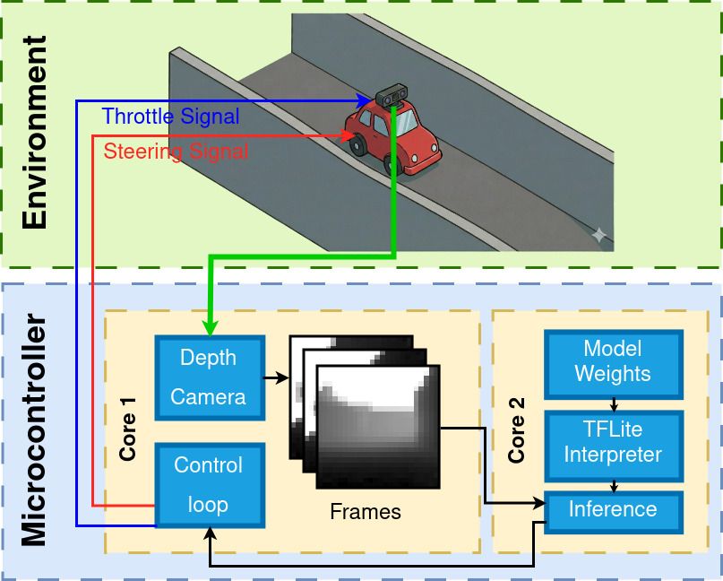
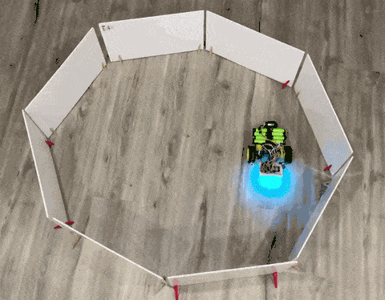
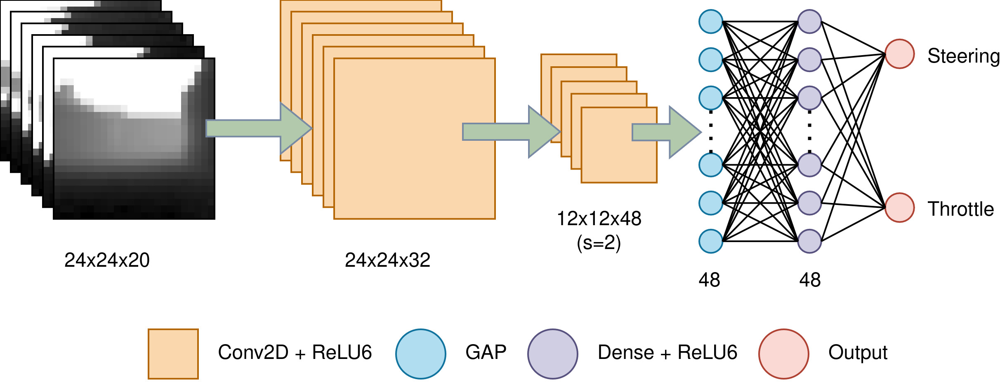
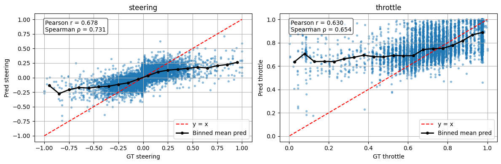
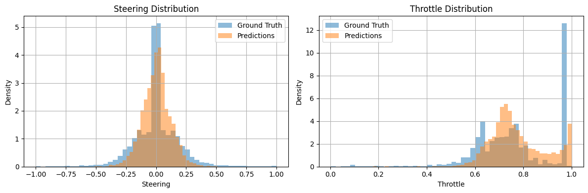
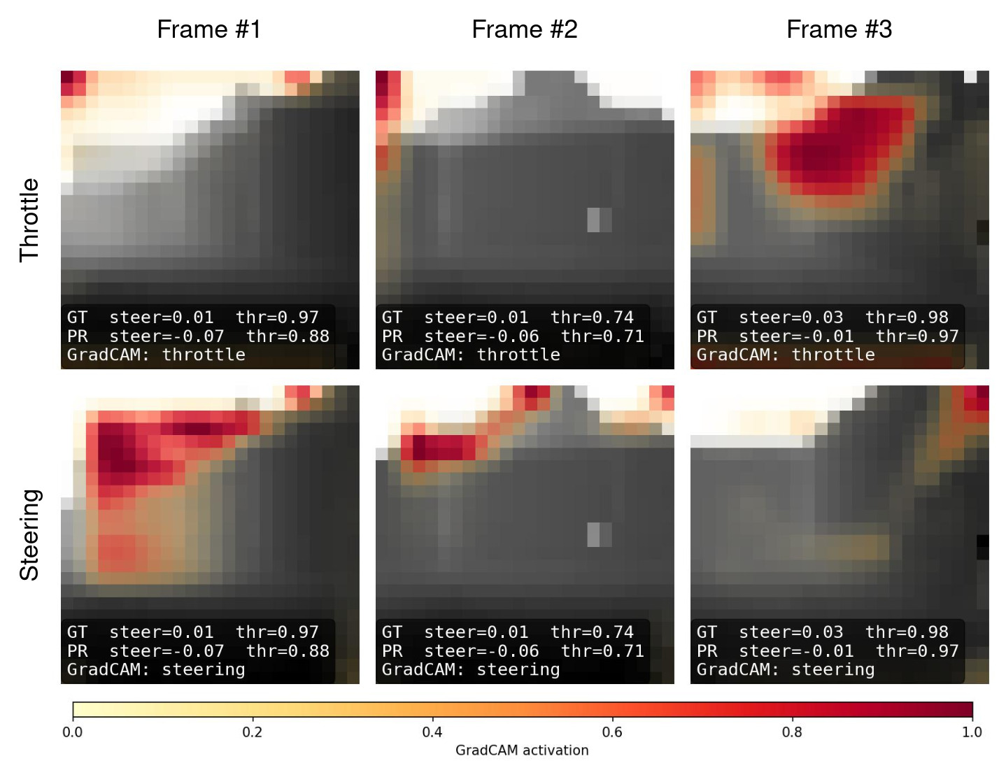

# TinyNav: End-to-End TinyML for Real-Time Autonomous Navigation on Microcontrollers

TinyNav is an end-to-end TinyML system that runs on an ESP32 microcontroller to perform real-time autonomous navigation using a compact, quantized convolutional neural network.

---

## Authors

- Pooria Roy — Queen's University (pooria.roy@queensu.ca)
- Nourhan Jadallah — Queen's University (23jpv1@queensu.ca)
- Tomer Lapid — Queen's University (23rtn2@queensu.ca)
- Shahzaib Ahmad — Queen's University (shahzaib.ahmad@queensu.ca)
- Armita Afroushe — Queen's University (24kb11@queensu.ca)
- Mete Bayrak — Queen's University (mete.bayrak@queensu.ca)

---

## Abstract

> Autonomous navigation typically relies on power-intensive processors, limiting accessibility in low-cost robotics. Although microcontrollers offer a resource-efficient alternative, they impose strict constraints on model complexity. We present TinyNav, an end-to-end TinyML system for real-time autonomous navigation on an ESP32 microcontroller. A custom-trained, quantized 2D convolutional neural network processes a 20-frame sliding window of depth data to predict steering and throttle commands. By avoiding 3D convolutions and recurrent layers, the 23k-parameter model achieves 30 ms inference latency. Correlation analysis and Grad-CAM validation indicate consistent spatial awareness and obstacle avoidance behavior. TinyNav demonstrates that responsive autonomous control can be deployed directly on highly constrained edge devices, reducing reliance on external compute resources. Code and schematics are available at: https://github.com/regularpooria/tinynav

---

## System diagrams

- Pipeline and TinyML integration:

  

---

## Demos

The following GIFs show TinyNav running on tracks it has never seen before:

-   — Robot driving a circular test track to verify steady-state control and loop behavior.
-  — Robot navigating a more complex layout with tighter turns and variable openings.

---

## Data collection: how the dataset was created

- Multiple track designs were used (circular, figure‑eight, tight mazes, and irregular/crooked-wall layouts) to expose the model to a wide variety of turning radii and occlusion patterns.
- Walls and lane boundaries were intentionally varied in spacing and orientation (including crooked walls) to force generalization and reduce overfitting to a single layout.
- This diversity in tracks and randomized starting positions helped improve robustness of steering and throttle predictions during deployment on constrained hardware.

---

## Model (short summary)

- Architecture: compact 2D CNN operating on a 20-frame sliding window (frames stacked as channels) to encode temporal cues while meeting strict latency budgets.
- Size & latency: ~23k parameters, ~30 ms inference on the target microcontroller.
- Outputs: separate heads for steering (range -1..1) and throttle (range 0..1).
- Design choices: avoided 3D convs / recurrent layers due to inference latency constraints on TFLite Micro and ESP‑NN.

---

## Validation and interpretability

We used multiple methods to validate performance and gain insight into the network's behavior:

- Correlation plots comparing prediction vs. ground truth for steering and throttle (see images_videos/corrolation.png).
- Distribution matching to ensure the model predicts the full variance of actions (see images_videos/distribution.png).
- Grad‑CAM visualizations to highlight spatial regions the model uses for steering and throttle decisions (see images_videos/gradcam_cnn_activations.jpg.jpg).

- 
- 
- 

These plots demonstrate the model's tendency to attend to track boundaries and opening corners, and a reasonable correlation to human-driven ground truth.